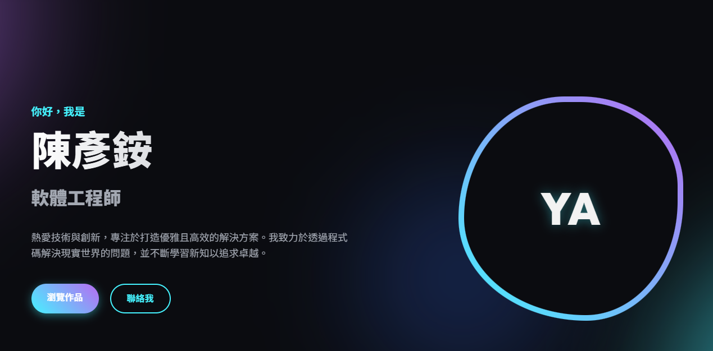

# 個人專屬網站 (Personal Portfolio Website)

這是一個極具現代感且功能強大的單頁式個人網站（Single-Page Application），專為展示個人簡介、技能與專案作品而設計。本專案結合了純靜態的前端技術，無須依賴複雜的框架即可達到極佳效能與視覺體驗。

## 🌐 網站預覽 (Preview)

👉 **線上瀏覽網址：** [https://e1458822-coder.github.io/0225DRL/](https://e1458822-coder.github.io/0225DRL/)

## ✨ 專案特色 (Features)

1. **極致美學的暗黑模式 (Premium Dark Mode):** 
   結合深邃神秘的背景色與青紫色的霓虹漸層色，營造出濃厚的科技感與現代高級感。
   
2. **微動畫與流暢互動 (Micro-animations):**
   - **背景漂浮氣泡：** 透過緩慢漂浮與高度模糊化處理的幾何圖形，賦予網站「生命力」。
   - **打字機特效：** 首頁主視覺文字採用動態打字機效果，自動輪播不同的職稱與特質。
   - **幾何漸變影像框：** 首頁的預設形象區塊使用了自動變形的流動幾何（Morphing Effect）邊框。
   - **滾動揭示效果 (Scroll Reveal)：** 隨著使用者向下滾動，內容區塊會優雅地由下往上淡入顯示。
   
3. **響應式設計 (Responsive Design):**
   完美支援各尺寸螢幕（桌機、平板、手機）。在行動裝置瀏覽時，提供流暢展開的漢堡選單 (Hamburger Menu)。
   
4. **毛玻璃特效 (Glassmorphism):**
   專案卡片、技能卡片以及置頂的導覽列皆結合了時下最流行的毛玻璃設計，兼具透明度視差與精緻的高光邊框效果。

## 🛠️ 使用技術 (Tech Stack)

- **HTML5:** 建立清晰且語意化的網頁結構。
- **CSS3 (Vanilla):** 
  - 核心佈局採用 Flexbox 與 CSS Grid。
  - 運用 CSS 變數（Variables）進行主題與色彩管理。
  - 包含大量手刻動畫特效（`@keyframes`）。
  - 字體選用 Google Fonts 上的現代字型 (`Inter` 與 `Outfit`)。
- **JavaScript (Vanilla):** 
  - 處理 DOM 元素互動與事件監聽。
  - 實作平滑頁面捲動與漢堡選單開關。
  - 利用 `IntersectionObserver` 打造高效能的頁面滾動動畫。
  - 客製化打字機字串的排程與動態替換。

## 📂 檔案結構 (Project Structure)

- `index.html`: 網站的主結構與所有展示內容。
- `styles.css`: 包含全站基礎樣式、色彩主題、響應式處理以及所有視覺動畫。
- `script.js`: 處理前端各種互動邏輯（導覽列變色、打字機動態、Scroll Reveal 等）。

---
*Designed & Developed for 陳彥銨*
